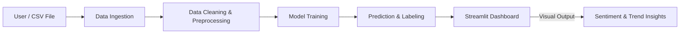

# 🧩 SENTIMENT-AND-TREND-TRACKER — V.0 Prototype Build

> **End-to-End Sentiment Analysis & Trend Visualization (Streamlit + scikit-learn Prototype)**
> The foundation of the *Intelligent Build — Real-Time Sentiment & Trend Tracker.*


---

## 🧠 Overview

**SENTIMENT-AND-TREND-TRACKER (V.0)** is the **first fully functional prototype** of the future *Intelligent Sentiment & Trend Tracking System*.
It demonstrates a **complete end-to-end pipeline**: data ingestion → cleaning → model training → prediction → visualization, implemented entirely in **Python + Streamlit**.

This version establishes the **technical backbone** for the next intelligent build (V.1) but operates entirely offline with sample datasets.

---

## 🎯 Objectives

* Ingest and clean textual datasets (reviews, feedback, notes).
* Train and deploy sentiment analysis models locally.
* Predict and visualize sentiment and emotion trends interactively.
* Log all steps for reproducibility and traceability.
* Provide a **modular, extendable architecture** for future development.

---

## ⚙️ Tech Stack

| Layer             | Tool / Library                | Description                         |
| :---------------- | :---------------------------- | :---------------------------------- |
| **Language**      | Python 3.10+                  | Core scripting                      |
| **Data Handling** | pandas, numpy                 | Data manipulation                   |
| **Preprocessing** | nltk, regex                   | Text cleaning & tokenization        |
| **ML / NLP**      | scikit-learn, joblib          | Sentiment classification            |
| **Visualization** | Streamlit, matplotlib, plotly | Interactive dashboard               |
| **Logging**       | Python `logging`              | Stage-wise pipeline logging         |
| **Config**        | dotenv, JSON                  | Environment and configuration setup |

---

## 🧩 Core Features

* ⚙️ **ETL Pipeline:** Raw data → Cleaned dataset → Model-ready inputs
* 🧠 **Machine Learning:** TF-IDF vectorization + Logistic Regression
* 💾 **Persistent Artifacts:** Saves processed data and trained model (`model.pkl`)
* 📊 **Interactive Dashboard:** Streamlit interface for real-time insights
* 🧰 **Traceability:** Logs every operation across ingestion, cleaning, and modeling
* 🚀 **Modular Design:** Components can run independently for testing or extension

---

## 🧱 Prototype Architecture



---

## 📂 Folder Structure

```
│   .env
│   .gitignore
│   app.py
│   requirements.txt
│
├───config
│       db_config.json
│
├───data
│       raw_data.csv
│       cleaned_dataset.csv
│
├───logs
│       data_cleaning.log
│       ingestion.log
│       model_training.log
│       model_prediction.log
│
├───models
│       model.pkl
│
├───pipeline
│       run_pipeline.py
│
└───scripts
    ├───ingestion
    │       data_ingestion.py
    ├───preprocessing
    │       data_cleaning.py
    └───model
            model_training.py
            model_prediction.py
```

---

## 💡 Workflow Steps

1. **Data Ingestion**
   Loads raw CSV datasets into `/data/raw_data.csv` and logs ingestion.

2. **Preprocessing**
   Cleans text (stopwords, punctuation, normalization) → outputs `/data/cleaned_dataset.csv`.

3. **Model Training**
   TF-IDF vectorization + Logistic Regression → serialized to `/models/model.pkl`.

4. **Prediction & Evaluation**
   Generates predictions using trained model → logs metrics in `/logs/model_prediction.log`.

5. **Visualization**
   `app.py` runs Streamlit dashboard → shows sentiment breakdown, trend charts, CSV upload, and refresh options.

---

## 🧰 Key Scripts

| File                  | Role                                                          |
| :-------------------- | :------------------------------------------------------------ |
| `app.py`              | Streamlit dashboard connecting data, model, and visualization |
| `data_ingestion.py`   | Loads and saves raw datasets                                  |
| `data_cleaning.py`    | Prepares and cleans text data                                 |
| `model_training.py`   | Trains and serializes sentiment model                         |
| `model_prediction.py` | Generates predictions and logs output                         |
| `run_pipeline.py`     | Automates ingestion → preprocessing → training sequence       |

---

## 🧠 Example Code Snippet

```python
import streamlit as st
import pandas as pd
import joblib

# Load trained model and vectorizer
model = joblib.load("models/model.pkl")
vectorizer = joblib.load("models/vectorizer.pkl")

st.title("Sentiment & Trend Tracker — Prototype (V.0)")

uploaded_file = st.file_uploader("Upload CSV File", type=["csv"])
if uploaded_file:
    data = pd.read_csv(uploaded_file)
    text = data["review_text"]
    X = vectorizer.transform(text)
    data["predicted_sentiment"] = model.predict(X)
    st.write(data.head())
    st.bar_chart(data["predicted_sentiment"].value_counts())
```

---

## 📊 Dashboard Output Example

<p align="center">
  
</p>

---

## ⚙️ Environment Setup

1. **Create virtual environment & activate:**

```bash
python -m venv venv
source venv/bin/activate  # Windows: venv\Scripts\activate
```

2. **Install dependencies:**

```bash
pip install -r requirements.txt
```

3. **Environment variables:**
   Create `.env` with:

```
DB_HOST=
DB_USER=
DB_PASSWORD=
API_KEY=
```

4. **Run end-to-end pipeline (optional):**

```bash
python pipeline/run_pipeline.py
```

5. **Launch Streamlit Dashboard:**

```bash
streamlit run app.py
```

---

## ✅ Outcome

The **V.0 prototype** provides:

* Offline sentiment analysis & trend visualization
* Modular and reproducible ETL + ML pipeline
* Fully functional Streamlit dashboard
* Foundation for the Intelligent Build (V.1)

---

## 🔗 Project Links

| Resource               | Link                                                                                         |
| :--------------------- | :------------------------------------------------------------------------------------------- |
| 🏠 **Main Repository** | [SENTIMENT-AND-TREND-TRACKER](https://github.com/GKTHIRUMARAN/SENTIMENT-AND-TREND-TRACKER)   |
| ⚡ **License**          | [MIT License](https://github.com/GKTHIRUMARAN/SENTIMENT-AND-TREND-TRACKER/blob/main/LICENSE) |

---

## 👤 Author
**GK Thirumaran**  
🎓 *B.Tech Artificial Intelligence and Data Science*  
🌍 *Coimbatore, Tamil Nadu, India*  
💼 *Aspiring Data Scientist & Analyst | AIML Developer*  
🔗 [Linkedin](https://www.linkedin.com/in/thirumarangk-ai) | [Porfolio](https://maranthiru180.wixsite.com/my-site)
